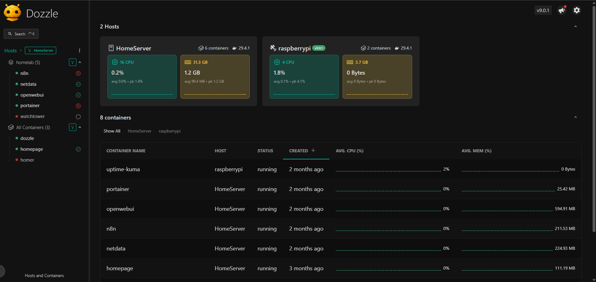
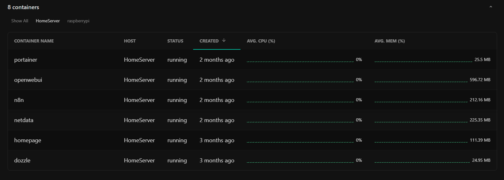
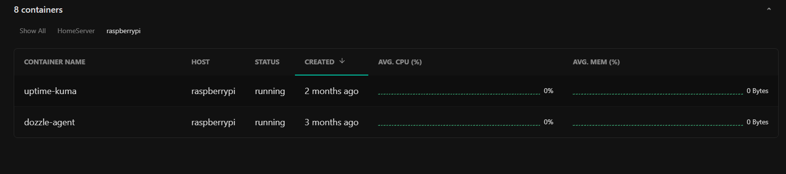

# 📜 Dozzle – Real-Time Docker Log Viewer

## Overview

Dozzle is deployed to provide real-time visibility into Docker container logs running on the main server. It enables quick debugging, monitoring, and inspection of container output through a lightweight web interface.

This setup also integrates a remote Dozzle agent (running on a Raspberry Pi) to allow centralized log access across nodes.

---

## 🧠 Setup Architecture

* **Main Server**
  * Runs Dozzle web UI
  * Connects to local Docker socket
  * Connects to remote Dozzle agent via Tailscale
* **Raspberry Pi**
  * Runs Dozzle agent
  * Exposes logs from remote containers

---

## 🔑 Key Features

* Real-time streaming of Docker container logs
* Web-based UI for easy access
* Remote log aggregation using Dozzle agent
* Lightweight and minimal resource usage
* Read-only access to Docker socket for safety

---

## 🌐 Access

* Web UI: `http://<server-ip>:8085`
* Accessible over LAN and via Tailscale

---

## 🔗 Remote Agent Integration

The `DOZZLE_REMOTE_AGENT` variable connects the main Dozzle instance to a remote agent running on another node (Raspberry Pi).

Example:

```bash
DOZZLE_REMOTE_AGENT=100.x.x.x:7007
```

This allows logs from multiple machines to be viewed in a single interface.

---

## 📦 Use Cases

* Debugging container failures
* Monitoring logs across multiple services
* Centralized log visibility in a multi-node setup
* Quick inspection without SSH access

---

## ⚠️ Notes

* Docker socket is mounted as read-only for security
* Ensure Tailscale is running for remote agent connectivity
* Dozzle is intended for development and lightweight monitoring, not long-term log storage

---

## 📸 Screenshots

* **Homepage**



* **HomeServer - Containers**



* **raspberrypi - Containers**


