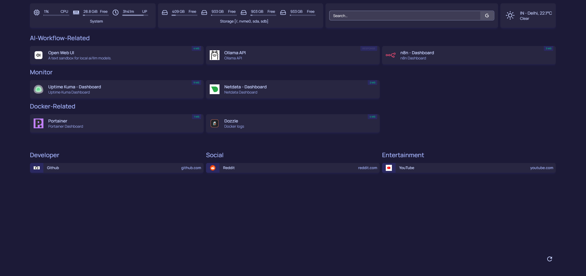

# 🏠 Homepage – Homelab Dashboard

## Overview

Homepage is used as the central dashboard for the homelab, providing a unified interface to access and monitor all running services.

It acts as a single entry point for navigating the infrastructure, improving visibility and usability across the system.

---

## 🎯 Purpose

* Centralize access to all self-hosted services
* Provide a clean, customizable dashboard
* Improve operational visibility of the homelab
* Reduce friction in managing multiple services

---

## 🧩 Role in System

Homepage runs on the main server and serves as the **UI layer** of the homelab.

It connects to:

* Container services (via Docker integration)
* System storage (for monitoring disks and resources)
* Internal service endpoints (for quick navigation)

This makes it the primary interface for interacting with the infrastructure.

---

## 🚀 Features

* Customizable dashboard layout
* Integration with Docker for service discovery
* Quick access links to all hosted services
* Visual grouping of services (AI, monitoring, automation, etc.)
* Lightweight and fast UI

---

## 🌐 Access

* Available on the local network (LAN)
* Accessible remotely via secure access (Tailscale)

---

## 🛠️ Technical Highlights

* Acts as a centralized UI for multi-service infrastructure
* Integrates with Docker socket for dynamic service visibility
* Uses mounted storage paths for system-level insights
* Designed for always-on availability with minimal resource usage

---

## 📸 Screenshots

* Main dashboard view:

  

---

## 🎯 Use Cases

* Quickly navigating between services
* Monitoring overall system layout
* Acting as a homepage/start screen for the homelab
* Reducing dependency on remembering service ports and URLs
